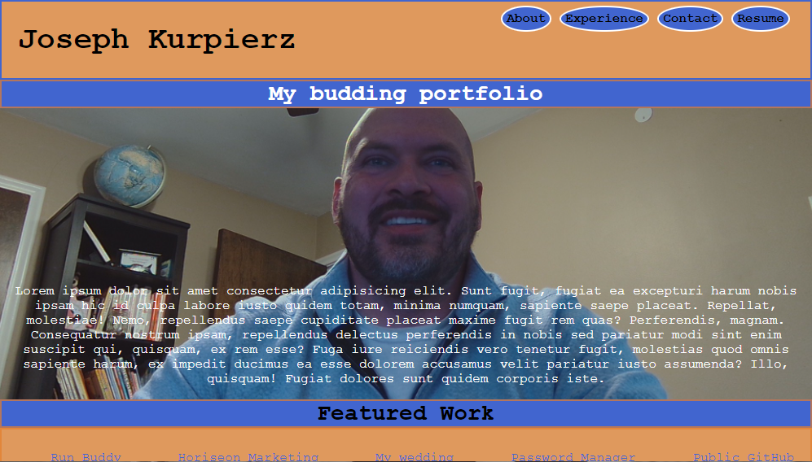

# PORTFOLIO

## Description

Basic webpage dedicated to me and the projects that I have completed using HTML and CSS.  It includes a section with an autobiographical description of my life as a coder, a list of my accomplished works that link to deployed websites, my contact information, and a downloadable version of my resume(comming soon).

This webpage was designed and built by me as an introduction into the coding community.  It will continue to grow as more projects are completed and will then perhaps be utilized as a reference for future employers to see my capabilities in a snapshot.

## Installation

There is no installation requirements as this is simply a live webpage.

# Usage

[Deployed website](https://josephkurpierz.github.io/portfolio/)

Responsive design elements were deployed to accomodate for multiple screen sizes.

# Credits

Construction sign was borrowed from https://publicdomainvectors.org/en/free-clipart/Under-construction-road-sign/80023.html

I followed the following resource as a guide to write this README https://umn.bootcampcontent.com/University-of-Minnesota-Boot-Camp/UofM-VIRT-BO-FSF-PT-04-2022-U-B/-/tree/main/01-HTML-Git-CSS/04-Supplemental/professional-readme-guide

I followed https://choosealicense.com/licenses/gpl-3.0/# to apply the license

# License

